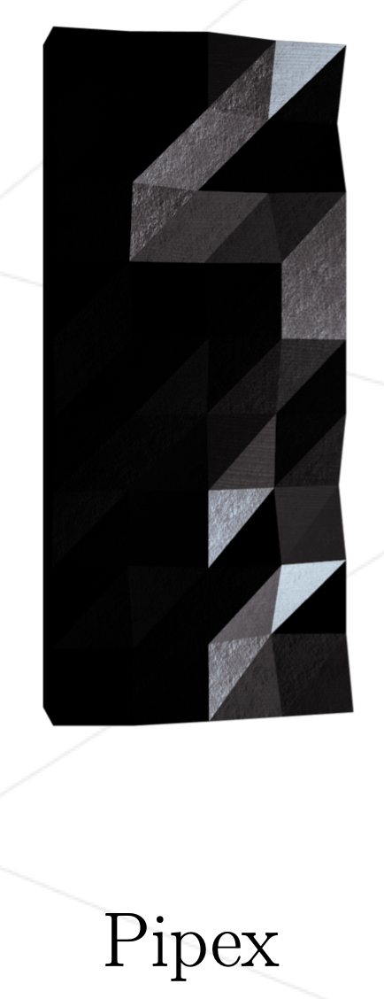
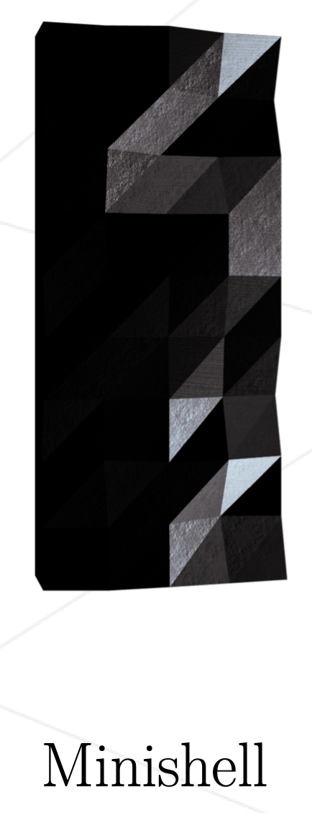
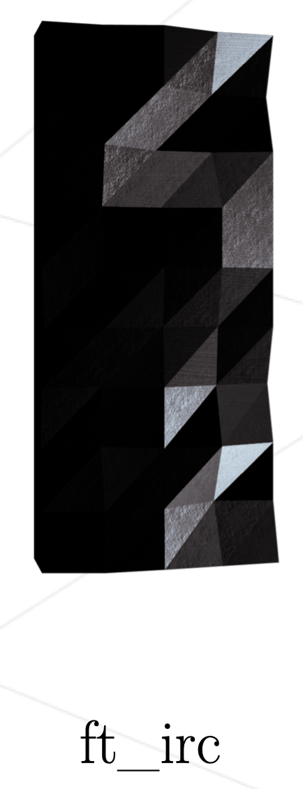

# Hello, I'm Joan  

I'm a Computer Science student at [42](https://www.google.com/url?sa=t&source=web&rct=j&opi=89978449&url=https://42.fr/&ved=2ahUKEwjjyoPFk7KOAxW9K_sDHfMHOwUQFnoECAwQAQ&usg=AOvVaw1Jn4i0LjOUW7B_zcaUisCq).

I'm actually focused on final project of common core which is "ft_transcendence".
 
 
currents goals :
 - complete commom core of 42
 - do personnal projects to improve my knowledge

My final goal is to be a MASTER of Blockchain and IA.
 

## 🧠 Actual learning

  

> C++ for the last project.
>
> Solidity for the last project and personnal projects.
 

##  Skills and Tools
### Programming Languages

> Getting by C and C++.
>
> Basic knowledge of Python.
 

### Web

> Basic knowledge of Html and Css
 

### IDE && VCS

> My main IDE is Visual Studio Code and i am confortable with VIM.
>
> I use GIT easily.
 

### Others

> Basic knowledge of Docker especially with project INCEPTION.

## Main 42 common core projects

 
 
 

## Connect with me 📬
- [x] My [Linkedin](https://www.linkedin.com/in/tudela-joan-735aa02a2/)
- [x] My email joantudela66@gmail.com
